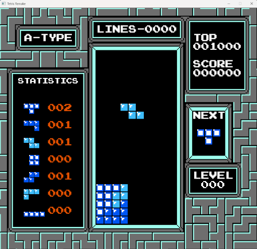

# TETRIS

With this project, I wanted to recreate a classic game from scratch using only C++ and SDL. I used an emulator and grabbed the graphics and sounds from memory (and I added some touch using Aseprite). I was once addicted to this game on the NES, and I coded the rules from what I remembered and with some help from Wikipedia. For me, coding this project is a hobby, a sort of kata, or a way to prove to myself that I can code games without having to look at tutorials, big commercial engines, or YouTube videos.

## HOW TO PLAY

The controls are the same use as default on most Emulator for a NES controller.

**LEFT and RIGHT arrows** : move the falling piece horizontally.

**DOWN arrows :** make the falling piece drop faster.

**X :** rotate the falling piece

**ENTER :** start the game / pause the game

## BUILD

If you want to just try the result, I included a build in the release section. Download the zip file and double-click the exe file.

